# SoRec – Digitalisation of Sorting Processes for Fine-Grained, Metal-Containing Waste Streams in the Recycling Industry

## Overview

Closing material and resource cycles is an integral part of the circular economy. Many products (especially electronic devices) are becoming increasingly complex regarding their structure and raw materials. To recover raw materials, the products must be broken down into ever-finier grain sizes and subsequently sorted. In general, dry sorting processes achieve good sorting results in the fine particle size range with lower throughputs. However, when increasing the throughput, the quality of the sorting results decreases considerably. In order to operate profitably, sorting machines must work as close as possible to the tipping point between good quality and maximum throughput while also minimising maintenance downtimes.

The SoRec project focuses on digitalising sorting processes for fine-grained, metal-containing waste streams in the recycling industry. By installing state-of-the-art industrial line cameras and sensors, we are digitizing the conventional sorting method on a moving belt. With the help of advanced AI models and algorithms in deep learning and machine learning, our system can accurately detect materials on the conveyor belt, classify them based on size, shape, and color, and even find their precise edges. With the capability to identify multiple layers of materials, the AI model provides valuable density and volume estimation. To ensure real-time efficiency and control, we have integrated the AI model with powerful computer vision techniques, which handle crucial image processing tasks. This seamless collaboration between AI and computer vision allows us to estimate the belt’s speed and detect any anomalies, ensuring precise sorting and preventing belt misalignments. Our materials, measuring 1 mm to 4 mm in size, demand meticulous attention to detail, necessitating high-level zoom capabilities for precise annotations. With this innovative AI-driven system, we are taking a significant step towards automating and optimizing the sorting process, enhancing productivity, and elevating the industry to new heights of accuracy and efficiency.

<span style="color:#537686;">Few images of our material have been shown in the images below.</span>

<p align="center">
  
  
  
</p>


## System Architecture

### High-Level Architecture
The high-level architecture of the project is shown below. Each box is an independent service or artifact.
The web portal is the interface to the user. Here the user sees bundled information on individual machines and can control them from there. Control works by sending an http request from the web portal to the ManageBackend. This forwards the request to the MachineBackend, which communicates with the machine via a PLC connection. The interpretation works the other way round. The MachineBackend reads the current status of a machine and sends this data to the ManageBackend. This forwards the data to the Azure Digital Twin Graph. An ManageBackend endpoint is then called from via Azure Eventgrid and notified that there is new data in the digital graph. This is then retrieved from the ManageBackend and forwarded to the web portal via a socket connection. We use an external identity server for authentication and authorization. In our system, this is a Duende service that adheres to the OIDC standard.


### Refined Architecture & Digital Twin

Below is the refined technical architecture of our individual services. 
* Web portal (React): The idea is that UI components manage their data independently. This ensures that they call use cases directly. The use cases then configure an http request that is sent to the ManagementBackend. If there are dependencies between Ui components, they must be able to inform each other when things have changed. There are state slices for this. These are used exclusively for change events and do not manage any data.
* ManageBackend (.net): The ManageBackend follows a simple architecture. Requests are received in the controller (Rest) or hub (Socket) layer. Communication with the database then takes place either directly via the context (in which the models are registered), a service is called to update the Azure Digital Twin Graph, for example, or a request is forwarded to the MachineBackend.
* MachineBackend (Flask): The MachineBackend follows a similarly simple architecture. Here, schedulers are added that measure the status of the machine at defined intervals, evaluate the data using AI models and send relevant data to the ManageBackend via a service.
* DigitalTwin: The digital twins are managed centrally in the Microsoft Azure portal. An Azure Digital Twin's instance has been set up that enables a graph-based display of the digital twins and their relationships. The ManagementBackend was expanded to include an interface to the Azure Digital Twin's API, with which twins can be created, deleted, updated and their relationships defined via the application. These operations can be carried out via the web portal.
The status data of the machines transmitted from the MachineBackend is processed in the ManagementBackend and provided graphically on the machine view page. This integration simplifies precise and needs-based updating of the digital twins in the Azure Digital Twin Graph.


### Domain Model

The domain model is the technical core of the system. Classic user management has been implemented. User profiles can be members of an organization. If they are members, they are able to invite other user profiles. They can accept or decline the invitation. Each member of an organization can create locations, i.e. locations where machines are located. There can be any number of machines at a location. Here you can also see which data is viewed for a machine. SpeedOfBelt and SpeedOfDrum can be measured directly. SortingQuality and ThroughPut are calculated by AI models. Cameras that record images are attached to a machine.


## Setup 
To implement the intelligent Twin-AI BECS system, we first installed the necessary hardware infrastructure and camera modules above the conveyor belt of the eddy current separator. As shown in the below image, a robust mounting stand was custom-built using industrial aluminum item profiles, enabling the installation of multiple cameras at various positions and angles for comprehensive coverage.

<p align="center">
  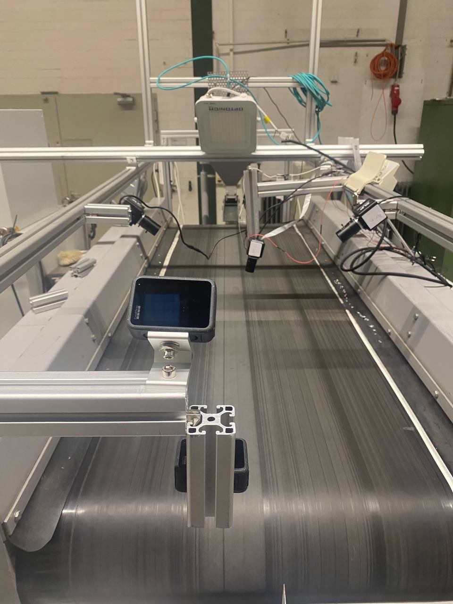
</p>

###  Cameras 

The Twin-AI BECS system utilizes a variety of camera modules, each serving a specific purpose in monitoring and optimizing the recycling process:

| Camera Model                          | Purpose                                                                 |
|--------------------------------------|-------------------------------------------------------------------------|
| **Basler raL 12288-8gm1 (Line-Scan Monochrome)** | Shape detection of fine metallic particles (1–4 mm) on the conveyor     |
| **4× ELP 8MP USB Cameras with HD 5–50 mm Lenses** | Color detection and classification of metals (aluminum, copper, brass)  |
| **2× GoPro Hero 12**                 | Capturing reference videos under various lighting and machine settings  |
| **Raspberry Pi Camera v2.1**         | Real-time detection of conveyor belt misalignment                       |
| **MLX90640 Thermal Camera**          | Monitoring temperature near the magnetic drum to detect overheating     |

This multi-camera setup was installed on a custom-built aluminum profile frame above the eddy current separator and remained in operation for approximately one year, enabling extensive data collection under various material conditions and speeds.

### Data Collection and Annotation
Over the course of approximately one year, the Twin-AI BECS system was deployed in a real industrial environment. During this period, various operating conditions were tested by adjusting the speeds of the conveyor belt, magnetic drum, and vibration feeder, while processing a wide range of input materials including aluminum, copper, plastic, and sharp-edged metals.

Images and videos were captured continuously from multiple camera angles. In parallel, several team members manually annotated the collected data to prepare high-quality training datasets for the machine vision models used in the project.

#### The complete dataset — including raw images, annotated masks, and labeled samples — is publicly available at:

[Project Dataset on Göttingen Research Online]([https://data.goettingen-research-online.de/dataverseuser.xhtml?selectTab=dataRelatedToMe](https://data.goettingen-research-online.de/dataverse/BECS-Smart-Separation-Data))

### SoRec Project Structure and Submodules

The comprehensive **SoRec project** (Smart Optimization and Recognition in Eddy Current Separator) was divided into **three core subprojects** to simplify implementation and modular development:

---

### Smart Conveyor System

**Objective**: Prevent physical and operational hazards, including:

- **Conveyor belt misalignment**, which may lead to material collision or falling
- **Overheating of the belt surface** due to trapped magnetic debris
- **Sharp-edged materials** passing through, which can damage the belt or cause inaccurate separation

#### This subproject includes the following key modules:

- **AutoBeltAlign**: Detects and corrects conveyor misalignment using OpenCV
- **FireGuard**: Detects fire risk and sends alerts via thermal camera and Telegram
- **Material-Edge-Detection**: Identifies sharp-edged particles using YOLOv11 segmentation
Note: Please refer to paper -> SmartBelt.pdf 

---

###  Metal Type and Color Recognition (PiVisionSort)

This module uses RGB camera input and color features (HSV space) to distinguish between different metal types, such as **copper vs. aluminum**.  
It employs lightweight machine learning algorithms like KMeans and Decision Trees, with real-time classification displayed directly on the video feed.
Note: Please refer to paper -> PiVisionSort.pdf

---

### Smart Separator Optimization

This submodule trains a **Random Forest regression model** to analyze output material weights and recommend optimal settings for:

- Conveyor belt speed  
- Magnetic drum speed  
- Vibration feeder rate  
- Drum angle  

This leads to improved separation quality and reduced energy consumption.
Note: Please refer to paper -> SmartSeparator.pdf

---

### Hardware and Software Requirements per Module

---
### To Get Start
- Clone the repository and install all the dependencies
  
```bash
git clone https://github.com/ETCE-LAB/SoRec-General.git        
cd SoRec-General         
```
 
**Requirements for Belt Misalignment Correction**

- Python version: 3.8 or higher  
- Required libraries:
  ```bash
  pip install opencv-python numpy matplotlib
  ```

- Operating system: Raspberry Pi OS or Ubuntu
- Camera: PiCamera 
- Motors: Stepper motors with driver for belt alignment correction
- Script:LineDetection.ipynb
- A visual representation is shown in the image below.
  
<p align="center">
  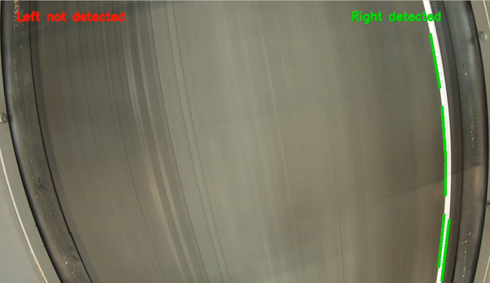
</p>


---


**Requirements for Thermal Fire Detection**

- Sensor: MLX90640 thermal camera (via I2C)
- A visual representation of the sensor setup is shown in the image below.
<p align="center">
  
</p>

- Required libraries:

```bash
pip install adafruit-circuitpython-mlx90640
pip install python-telegram-bot
pip install python-opcua
```

- Telegram Bot: Set the token in a .env file
- PLC Integration: Define an OPC UA node:
  
```bash
OPC_Daten.Anlage_ausschalten (index = " keep your PLC's index number")
```
- Script:Fire_detection_module.ipynb
  
---


**Requirements for Material Edge Detection with YOLOv11**

- Recommended system: Laptop with a dedicated GPU for fast inference
- A visual representation of the sensor setup is shown in the image below.

<p align="center">
  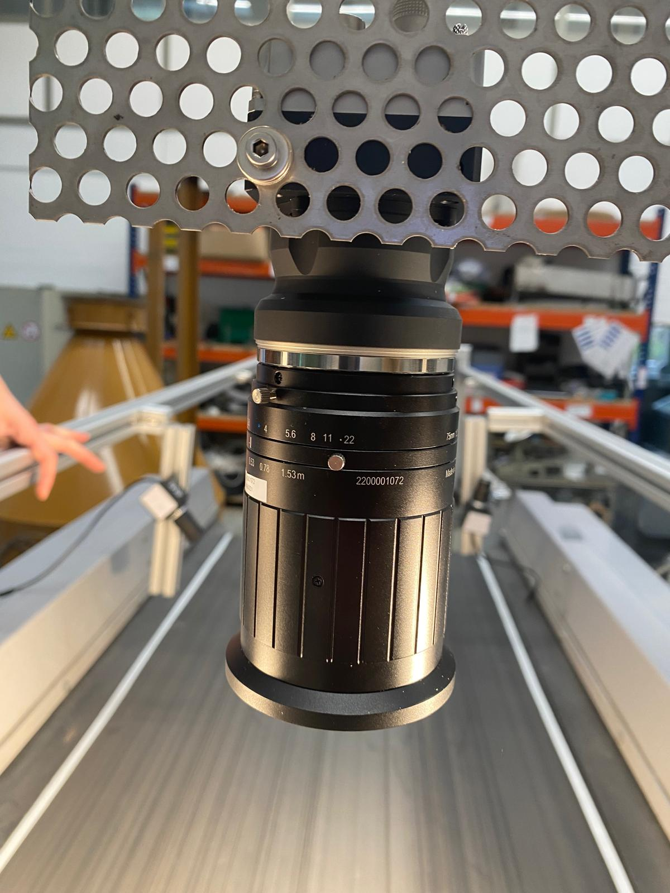
  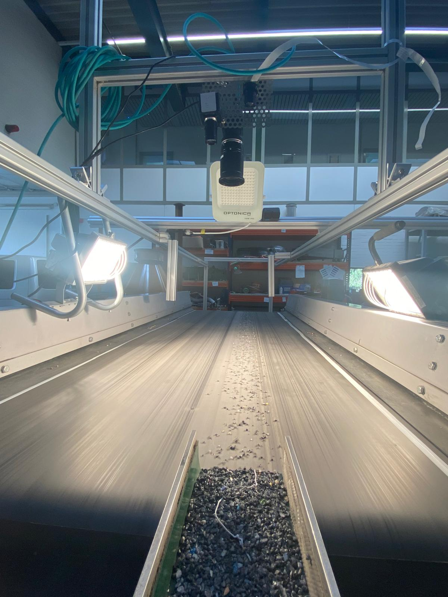
  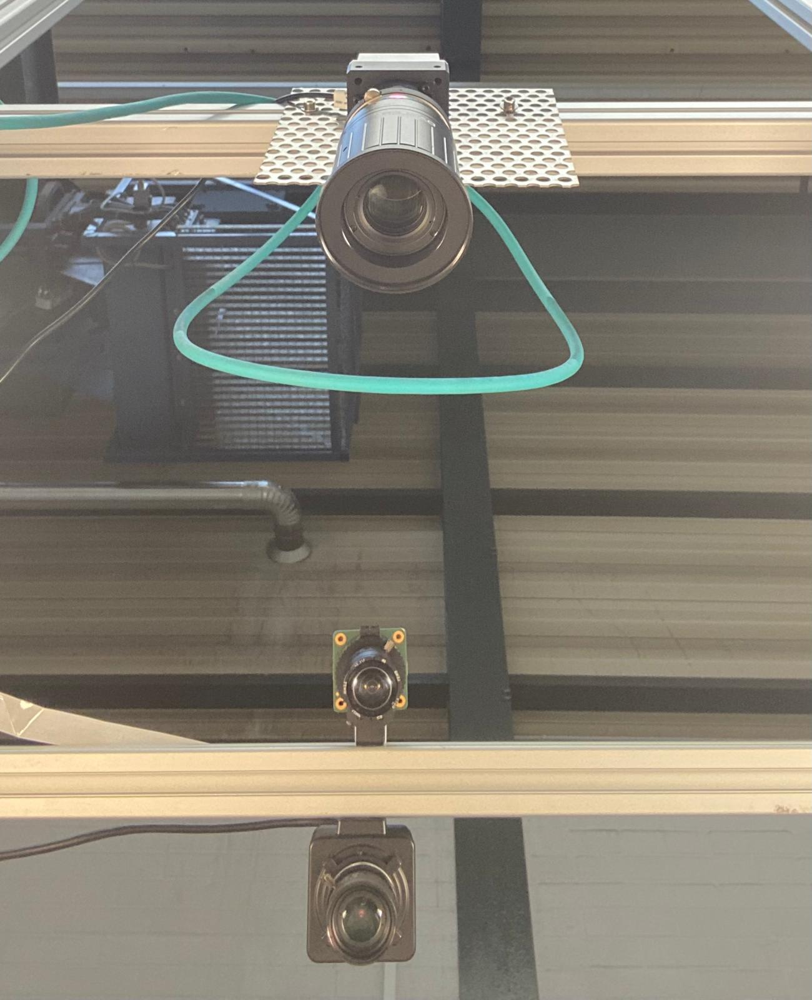
</p>

- Install PyTorch and Ultralytics:
```bash
pip install torch torchvision
pip install ultralytics
```
- Run the YOLOv11n model using a pre-trained checkpoint
- Image Input: Serial input from a monochrome Line-Scan camera 
- Script: Yolo11-EdgeDetection.ipynb
- A visual representation of the result is shown in the image below.
<p align="center">
  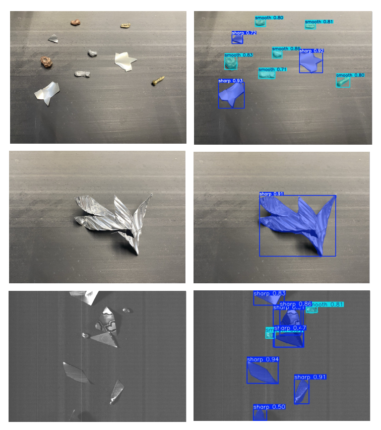
</p>

**Troubleshooting & Common Challenges**

This section outlines the most common issues you might face during setup and execution, along with recommended solutions and relevant commands.
ـ- 
**YOLOv11 Setup: GPU Inference Issues**

One common issue with YOLOv11 is the model not running on the GPU even when one is available. This is usually due to:

- Mismatched PyTorch and CUDA versions
- Missing or misconfigured GPU drivers
  
**Solution: Verify GPU Compatibility**

Make sure your system detects your GPU and PyTorch is configured for CUDA:

```bash
python -c "import torch; print(torch.cuda.is_available())"
```
If the output is False, your model is running on CPU and you must:

- Install correct GPU drivers for your hardware (e.g., NVIDIA)
- Install PyTorch with CUDA support. Recommended version for YOLOv11:

```bash
pip install torch torchvision torchaudio --index-url https://download.pytorch.org/whl/cu118
```

Check torch version and device:

```bash
import torch
print(torch.__version__)
print(torch.cuda.get_device_name(0))
```
- If using Jupyter Notebook, ensure the runtime uses GPU:

```bash
!nvidia-smi
```

**Line-Scan Camera Image Quality Issues**

Working with line-scan cameras requires careful setup to achieve optimal image quality. Problems often arise due to poor lighting, lens mismatch, or incorrect camera speed.

Best Practices:

- Ensure consistent and strong lighting — preferably diffuse LED panels.
- Use proper lens and distance from the conveyor belt (adjust based on object size and camera resolution).
- Test with varied conveyor speeds to avoid motion blur.
- Verify your line-scan camera software (e.g., Pylon Viewer) is installed and configured:
  
```bash
sudo apt update
sudo apt install pylon
```

**PyTorch & Ultralytics Compatibility**

To avoid dependency issues, it’s important to install the compatible versions of PyTorch and Ultralytics:

```bash
pip install torch==2.0.1 torchvision==0.15.2
pip install ultralytics
```

Check versions to confirm installation:

```bash
python -c "import torch; import torchvision; print(torch.__version__, torchvision.__version__)"
```

**Line-Scan Image Annotation Format**

If you're facing issues with training or annotation:

- Use YOLOv11 segmentation format (with .txt polygon coordinates)
- Make sure all .txt label files match image names and are inside the correct folder (usually train/labels)
- You can use tools like Roboflow, LabelMe, or CVAT for proper annotation.

---

**Requirements for Metal Type and Color Detection**

This module identifies metallic materials (e.g., copper vs. aluminum) using color features extracted from RGB cameras.  
A Raspberry Pi was used with an ELP USB camera and a PIR motion sensor mounted above the vibration feeder (vibro-feeder) and conveyor belt.  
As shown in the image below, the ELP camera was fixed to monitor material flow for real-time color analysis.

<p align="center">
  
</p>


- Color space: HSV  
- Algorithms used: KMeans clustering and Decision Trees  
- Live video output: Annotated in real time with class labels  
- Dataset: Custom dataset with RGB values and class labels (CSV format)

### Hardware:
- Raspberry Pi 4
- ELP 8MP USB camera with 5–50mm lens (mounted above feeder)
- PIR motion sensor

### Software requirements:
```bash
pip install opencv-python scikit-learn pandas numpy
```
- OS: Raspberry Pi OS or Ubuntu
- Script: lsm_beforewebcam.py and gravels_count.py
- Input data: hsv_data.csv
- A visual representation of the result is shown in the image below.
<p align="center">
  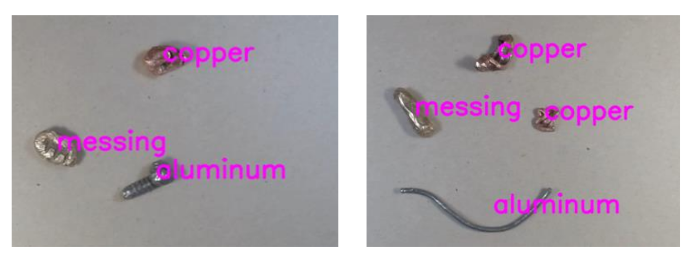
</p>


**Camera not working or not detected ?!**

If PiCamera or USB cameras (like ELP or GoPro) are not detected:
Check Raspberry Pi OS config:

```bash
sudo raspi-config
```
- Go to Interface Options → Camera → Enable

For USB cameras:

```bash
ls /dev/video*
```

Use OpenCV to verify:

```bash
import cv2
cap = cv2.VideoCapture(0)
print(cap.isOpened())
```
---


**Requirements for System Speed Optimization**
- This subsystem learns optimal speed settings for the conveyor, drum, and vibration feeder using a trained Random Forest model.
- 81 different separation scenarios were tested and recorded, covering combinations of input materials and speed settings.
- The model’s input features are the measured weights of misclassified materials after separation (plastic, aluminum, copper and brass), and energy consumption.
- The model outputs the recommended optimal speed values to improve sorting accuracy while minimizing power usage.
- A few visual representation of error collection process is shown in the below images.
<p align="center">
  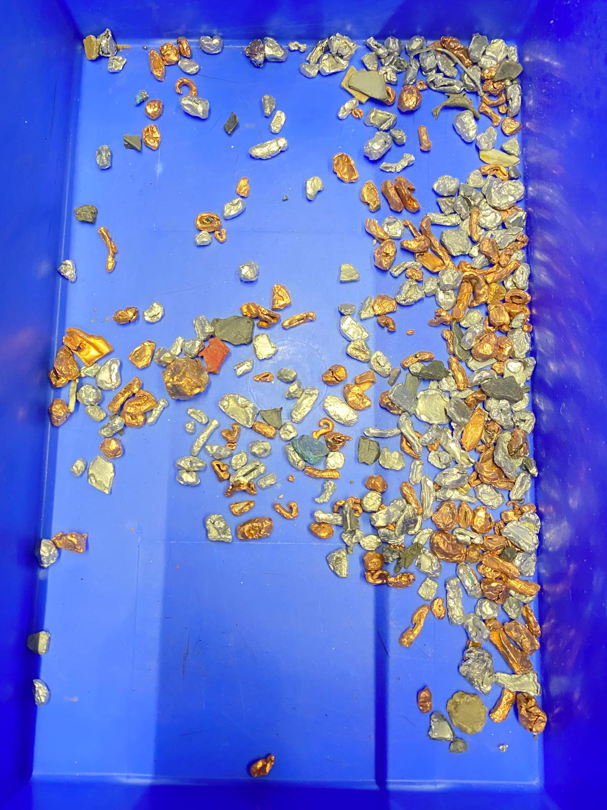
  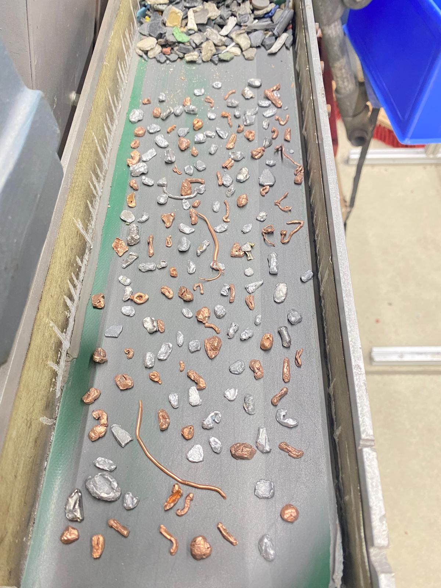
  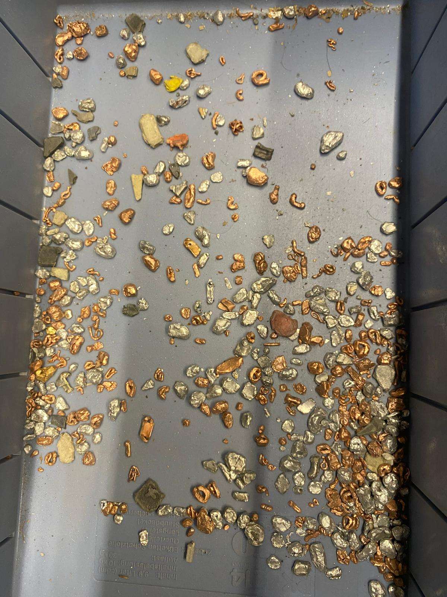
</p>


###  Software requirements:
- Python 3.11+
```bash
pip install pandas scikit-learn matplotlib openpyxl
```
- Jupyter Notebook environment recommended
- Input data:SpeedOptimizationDataset.ods
- Script: Smart-Separator.ipynb

- The below images shows an accurate separation of the materials.
<p align="center">
  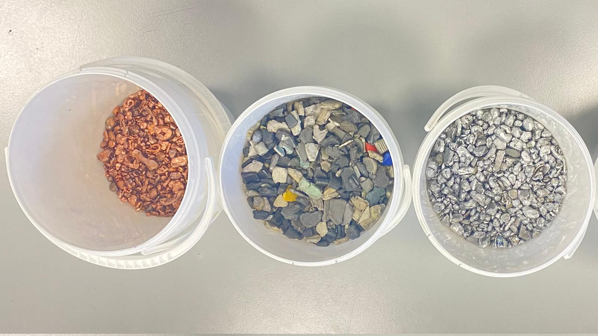
</p>


### Case Study: Deployment in Real Industrial Environment

The **Twin-AI BECS** system was deployed in a real e-waste recycling facility over the course of one year. During operation, several key challenges were identified:

- Frequent conveyor belt misalignments, causing material loss and mechanical issues. 
- Risk of overheating and fire due to trapped ferromagnetic particles near the magnetic drum. 
- Inaccurate separation caused by the presence of sharp-edged or irregular materials.  
- Low separation accuracy, especially when input materials varied in shape and size (1mm-4mm).  
- High energy consumption due to unoptimized speed configurations for the drum's angle, conveyor belt, and vibration feeder.  

To address these issues, we implemented the following smart modules:

- `BeltMisalignmentDetection and Correction`: For detection and correction of conveyor misalignment using OpenCV and stepper motors. 
- `FireGuard`: For thermal fire detection and alerting via Telegram.  
- `Material-Edge-Detection`: To classify sharp vs. smooth materials on the belt using YOLOv11.  
- `PiVisionSort`: For metal color recognition (e.g., copper vs. aluminum and brass) using RGB analysis.  
- `Smart-Separator`: A Random Forest model to recommend optimal speed settings for belt, drum's angle, and vibration feed, based on weight analysis at the output.   


## Contributors (Past and Present)
1. Shohreh Kia
2. Johannes Mayer
3. Mariella Rönn
4. Hooman Taghizadeh
5. Mattes Knigge
6. Benjamin Leiding
